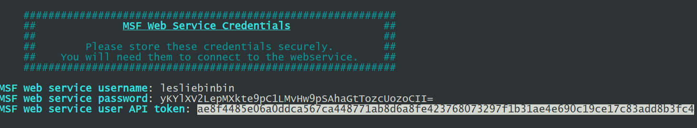
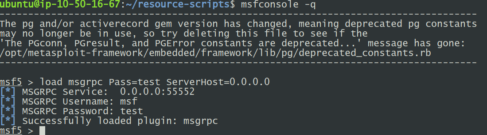

#+OPTIONS: ^:nil
* Project Description
This project belongs to **Phase 4** , the  **Attack Execution**
** Prerequisite
    - This project is based on __Python 3.6__ and use __pipenv__ as python third party libraries management
      tool, so __pipenv__ should be installed before running this project
      - in windows use administrator cmd or whatever that can give you
        administrator access, and then execute
       #+begin_example
       pip install pipenv
       #+end_example
      - in linux or mac, execute
       #+begin_example
       sudo pip3 install pipenv
       #+end_example
    - The third party libraries dependency for this project are in the
      _Pipfile_, while _Pipfile.lock_ will constraint the specific version of
      each third party library
    - When the **pipenv** has been installed, under this project directory, execute
      #+begin_example
      pipenv install --dev
      #+end_example
    - There should be a __Metasploit_ running with _RPC_ mechanism activated,
      and via the _attack-config.yml_ file, this program can connect to the
      _Metasploit_, and sending request to automate the attack, the
      configuration to connect to _Metasploit_ will be explained later in the
      **Project Structure**

** Structure

 The whole project consists of 2 configuration files and 9 python files.

*** Configuration Files

**** The attack-config.yml file
 The _attack-config.yml_ includes:
- _token_ for query _Metasploit_ database for the attack result.
- _remote-dir_ the directory in the host that _Metasploit_ is running in order
  to store the generated _Resource Script_
- _host_ the domain name or ip that _Metasploit_ is running on
- _attack-timeout_ since during the attack is stop and wait, we don't want to
  wait forever, so if an attack does not give response after _attack-timeout_
  second, we consider this attack fails
- target-config: the location of the target configuration file
- rpc: authentication to connect to _Metasploit_
In order to generate a token, execute the below steps:
#+begin_example
msfdb reinit
# enter Y when "[?] Would you like to delete your existing data and configurations?" shows up
# enter twice
#+end_example
a sample token can be found in the screenshot below:
#+CAPTION: Metasploit Token
#+NAME:   fig:msf-token

There are two approaches to activate _Metasploit RPC_,
The first one is via _Metasploit Console_, it is recommend do it in this way why
doing experiments
#+CAPTION: RPC via Metasplloit Console
#+NAME:   fig:rpc-console

The second is directly execute the command in the terminal, this is recommended
in production
#+begin_example
msfrpcd -U msf -p 55552 -P test -S
#+end_example

**** The target-config.json file
This configuration file  includes:
- approach: the metric approach name
- targets: the target hosts, this is to record the first time that successfully
  exploit the target host since the attack starts
- path-file :the location of attack paths file generated by Phase 3

*** Python files

**** main.py file
     this is the entry point for this whole project, simply execute
     #+begin_example
     pipenv run ./main.py
     #+end_example
     and the attack will be execute

**** configuration.py
     This file is to read configuration files, e.g. _attack-config.yml_,
     _target-config.json_ and then initialize constants to represent the
     configuration information
**** py_client.py
     This is the python file used to connect to _Metsploit RPC_
**** basic_usage.py
     This file contains functions to generate _Metasploit_ _Resource Script_ and
     execute _Metasploit_ _Resource Script_
**** vul_search.py
     This file contains the functions to search for _Metasploit_ attack module
**** node.py
     This file contains a python class _VulNode_ which is used to capture the
     host and vulnerability information
**** data_processing.py
     This is the file that transform attack file generated from Phase 3 into a
     internal data representation, the transformed attack paths can be
     represent:
#+begin_example
[[VulNode(), VulNode()], [VulNode(), VulNode()], ...]
#+end_example
**** traverser.py
     This file contains the functions to traverse the nodes in attack paths
**** report.py
     This file contains the functions to query attack results from _Metasploit_
     database and generate attack execution report.
